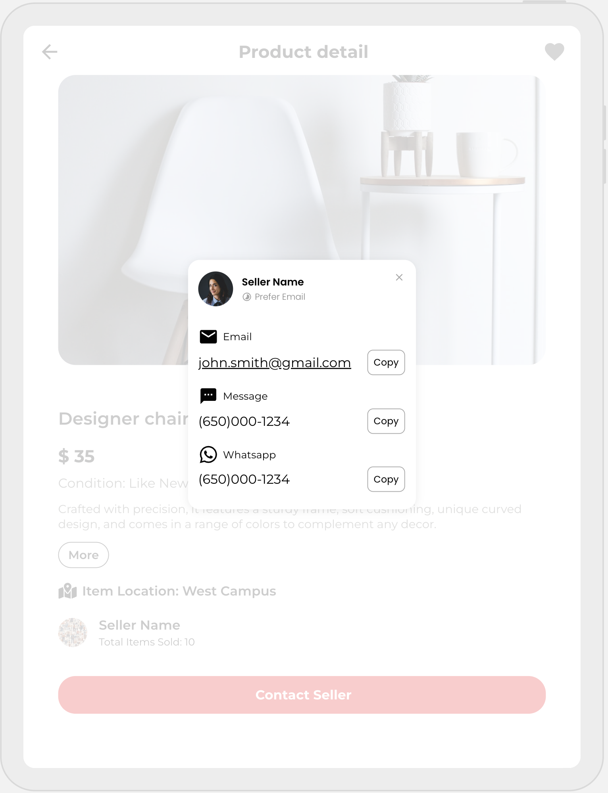

# Campus Cycle

Campus Cycle is a localized e-commerce platform designed specifically for college students to buy and sell used goods and furniture. This platform addresses the needs of college students who frequently move, offering an affordable, sustainable, and community-driven solution.

## Project Structure

The project is structured into separate directories for the frontend and backend:

- The `frontend` directory contains the client-side code built with Vue.js, including components for different views such as the home page, product detail page, user profile, and forms for adding and editing listings.
- The `backend` directory contains the server-side code built with Node.js, Express, and MongoDB. It includes the server setup, database connection, middleware, models, and API routes for handling various operations like user authentication, listing management, search functionality, and admin-specific tasks.

The project also includes Docker configurations for containerizing the frontend and backend applications, as well as Kubernetes manifests for deploying the application to a Kubernetes cluster.

## Key Features

- User Management: User authentication using GitLab OIDC, and customizable user profiles.
- Create and Edit Listings: Creation and management of listings with location tagging.
- Product Search: Filter options for category, location, price, and item condition.
- Contact Exchange: Facilitate contact sharing for buyer-seller interactions.
- Item Unlisting: Option to mark items as sold to remove from active listings.
- Responsive Design: Seamless experience on both web and mobile.

## Technologies Used

- Frontend: Vue.js, TypeScript, HTML, CSS
- Backend: Node.js, Express, TypeScript
- Database: MongoDB
- Authentication: GitLab OIDC
- Testing: Playwright for end-to-end testing
- Containerization: Docker
- Deployment: Kubernetes
- CI/CD: GitLab CI/CD Pipeline

## Key App Screens

## Key App Screens

## Key App Screens

  

    
    
<em>Home Screen: Search bar, categories, and featured items grid</em>

  

  

    
    
<em>Login Screen: User authentication with registration option</em>

  

  

    
    
<em>Product Detail: Images, info, and seller contact button</em>

  

  

    
    
<em>Profile/My Listing: User info, stats, and active listings</em>

  

  

    
    
<em>Edit Listing: Form for creating/editing product listings</em>

  

  

    
    
<em>Contact Seller: Pop-up dialog with seller's contact info</em>

  

## Team Members and Division of Labor

- Xie, Xinyi - Frontend Dev
  - UI Design Implementation: Translate UI/UX designs into functional web components.
  - State Management & Routing: Implement state management and Vue Router for navigation between pages.
  - Integration with Backend: Consume RESTful API endpoints. Handle data fetching and display content based on API responses.

- Li, Zebang - Backend Dev
  - API Design & Implementation: Develop RESTful API endpoints for authentication, user management, listing operations, etc.
  - Database Management: Design and implement MongoDB schemas.
  - Security: Implement data validation, user authentication, safe concurrency handling, etc. Ensure the effectiveness of role-based access control.

Both team members contribute to containerizing the application, deploying it, and creating and maintaining end-to-end tests.
